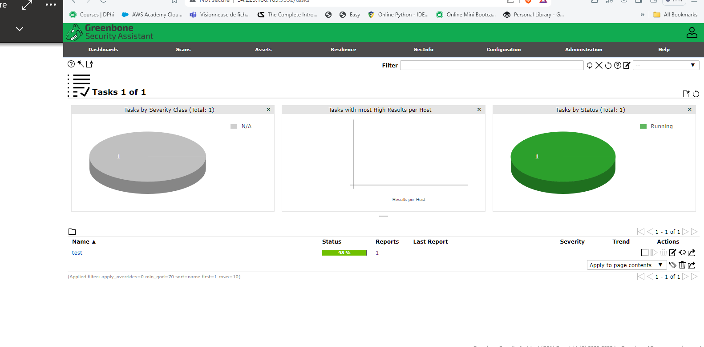
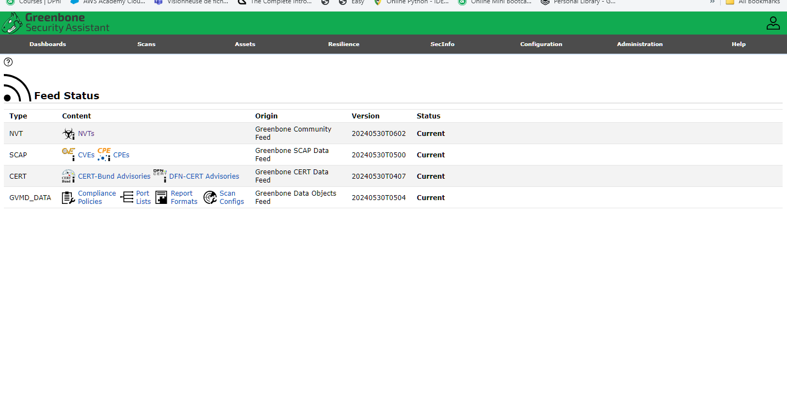

# Save the provided README content into a README.md file

readme_content = """
# Greenbone Security Assistant

## Introduction
Greenbone Security Assistant (GSA) is a web-based interface for managing and controlling the Greenbone Vulnerability Management (GVM) framework. GVM is a comprehensive solution for network vulnerability scanning and management, offering a wide range of tools and features for identifying and mitigating security vulnerabilities in networked systems.

## Table of Contents
- [Introduction](#introduction)
- [Table of Contents](#table-of-contents)
- [What is Greenbone Security Assistant?](#what-is-greenbone-security-assistant)
- [Components and Utilities](#components-and-utilities)
  - [Dashboards](#dashboards)
  - [Scans](#scans)
  - [Assets](#assets)
  - [Resilience](#resilience)
  - [SecInfo](#secinfo)
  - [Configuration](#configuration)
  - [Administration](#administration)
- [Feeds](#feeds)
  - [NVT (Network Vulnerability Tests)](#nvt-network-vulnerability-tests)
  - [SCAP (Security Content Automation Protocol)](#scap-security-content-automation-protocol)
  - [CERT (Computer Emergency Response Team)](#cert-computer-emergency-response-team)
  - [GVMD_DATA (Greenbone Vulnerability Management Data)](#gvmd_data-greenbone-vulnerability-management-data)
- [Summary](#summary)
- [License](#license)

## What is Greenbone Security Assistant?
Greenbone Security Assistant (GSA) is a powerful web-based user interface designed to manage the Greenbone Vulnerability Management (GVM) framework. GSA provides users with the ability to configure scans, manage assets, and view detailed reports on vulnerabilities detected in networked systems.

## Components and Utilities

### Dashboards
The dashboard provides an overview of the security status, including tasks by severity class, tasks by status, CVEs by creation time, and NVTs by severity class.

### Scans
Manage and configure vulnerability scans, view scan results, and generate reports.

### Assets
Manage networked assets, including hosts and networks, and view their security status.

### Resilience
Configure and manage resilience settings to ensure continuous security monitoring.

### SecInfo
Access detailed security information, including vulnerability details and security advisories.

### Configuration
Manage system settings, including user accounts, scan configurations, and report formats.

### Administration
Administer the GSA, including system updates and maintenance tasks.

## Feeds

### NVT (Network Vulnerability Tests)
- **Type**: NVTs (Network Vulnerability Tests)
- **Content**: Tests to identify vulnerabilities in networked systems.
- **Origin**: Greenbone Community Feed
- **Version**: 20240530T0602
- **Status**: Current

This feed provides up-to-date vulnerability tests that help in scanning network devices for known vulnerabilities.

### SCAP (Security Content Automation Protocol)
- **Type**: CVEs (Common Vulnerabilities and Exposures), CPEs (Common Platform Enumerations)
- **Content**: Data related to known vulnerabilities and platform enumerations.
- **Origin**: Greenbone SCAP Data Feed
- **Version**: 20240530T0500
- **Status**: Current

This feed includes data on known vulnerabilities and the platforms they affect, essential for vulnerability assessment and compliance.

### CERT (Computer Emergency Response Team)
- **Type**: CERT-Bund Advisories, DFN-CERT Advisories
- **Content**: Security advisories from CERT organizations.
- **Origin**: Greenbone CERT Data Feed
- **Version**: 20240530T0407
- **Status**: Current

This feed provides security advisories issued by CERT organizations, offering information on recent security threats and recommended actions.

### GVMD_DATA (Greenbone Vulnerability Management Data)
- **Type**: Compliance Policies, Port Lists, Report Formats, Scan Configs
- **Content**: Data objects used for configuring and reporting within the Greenbone solution.
- **Origin**: Greenbone Data Objects Feed
- **Version**: 20240530T0504
- **Status**: Current

This feed includes various data objects necessary for the configuration and operation of the Greenbone vulnerability management system, including policies for compliance checks, lists of ports to scan, formats for reports, and scan configurations.

## Summary
Each feed provides specific data critical to the functioning of a Greenbone security solution, ensuring that the system is up-to-date with the latest vulnerability tests, threat advisories, and configuration data. The feeds are all current as of the timestamps provided, ensuring the system has the latest information to maintain security.

## Dasbord Home

## feed status

